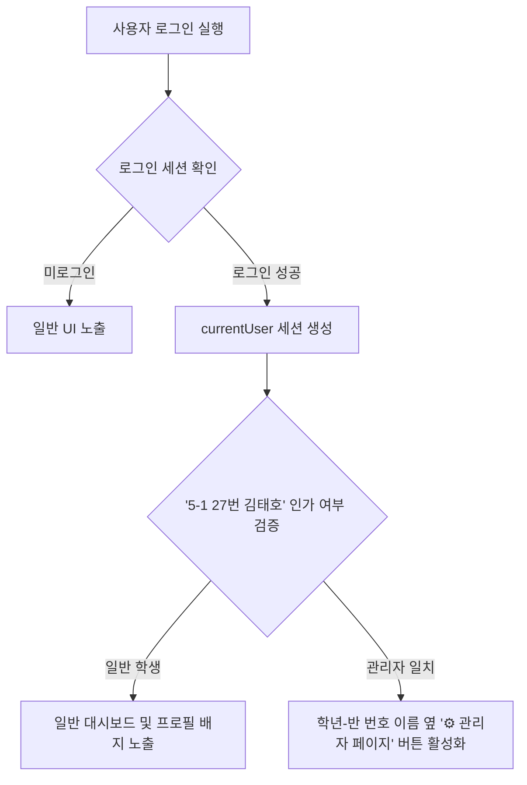
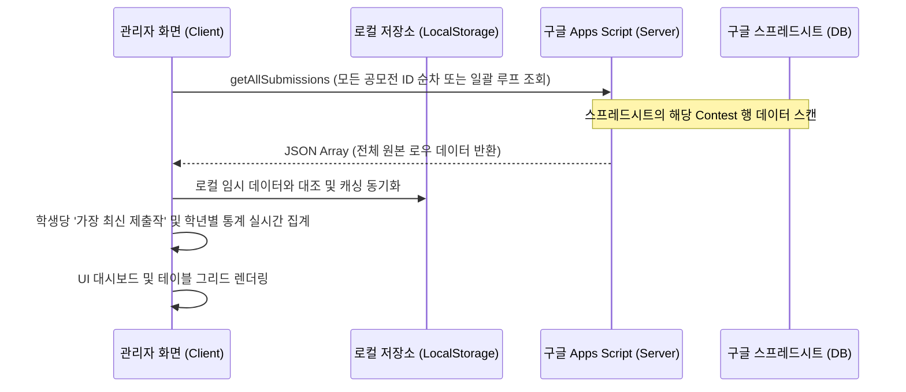

# SORO 플랫폼 관리자 페이지(Admin Page) 연동 및 개발 상세 설계서
`admin_page_plan.md`

본 문서는 사용자의 요청에 따라 SORO 플랫폼에 탑재할 **관리자 페이지(Admin Page)**의 타당성 검토, 설계 사양 및 구현 방안을 구체화한 개발 기획서입니다.

---

## 1. 개요 및 목적 (Introduction)
SORO 플랫폼의 연간 공모전(키링, 컷툰, 온라인 도서관, 디지털 필사, 픽셀아트, 우정사진)이 성황리에 진행됨에 따라, 학생들의 출품 현황과 작품 데이터를 한눈에 모니터링하고 관리할 수 있는 **중앙 통제 시스템(관리자 대시보드)**의 필요성이 대두되었습니다.

- **목적**: 특정 권한을 가진 사용자("5학년 1반 27번 김태호")가 로그인했을 때 관리자 페이지를 활성화하고, 전체 화면(Full-screen) 환경에서 공모전별 총 출품작 수, 참여 학급/인원 수, 작품 원본 조회 및 원격 삭제가 가능한 고성능 통합 관리 툴을 제공합니다.

---

## 2. 관리자 인증 및 인가 설계 (Authentication & Role Checking)
안전한 관리자 권한 제어를 위해 하드코딩된 세션 키 대신, 학적 정보를 조합한 로그인 세션 검증 방식을 도입합니다.



### 권한 확인 로직 (`app.js` 적용 예정)
```javascript
const isAdminUser = (user) => {
  return user && 
         parseInt(user.grade, 10) === 5 && 
         parseInt(user.classNum, 10) === 1 && 
         parseInt(user.number, 10) === 27 && 
         user.name === "김태호";
};
```
- **동적 버튼 토글**: `updateUIForLoggedInState()`와 `updateUIForLoggedOutState()` 함수 내부에서 이 조건을 실시간으로 체크하여, 관리자 전용 진입 버튼(`admin-panel-trigger-btn`)을 노출하거나 감춥니다.

---

## 3. 화면 구성 및 레이아웃 (Layout & Full-screen Transition)
픽셀아트 에디터와 마찬가지로, 기존 화면을 가리지 않고 뷰포트를 가득 채우는 **다크 뮤지엄 테마의 전체 화면 레이아웃**을 구현하여 프리미엄 시각 경험을 완성합니다.

```css
/* style.css 반영 예정 */
.drawer.admin-fullscreen {
  z-index: 1200; /* DID 전시관 바로 아래, 모달 최상단 배치 */
}

.drawer.admin-fullscreen .drawer-content {
  width: 100% !important;
  max-width: 100% !important;
  height: 100% !important;
  border-radius: 0 !important;
  background: var(--bg-primary, #0c0c0e) !important;
  transform: translateY(100%); /* 아래에서 위로 슬라이드 업 트랜지션 */
  transition: transform 0.4s cubic-bezier(0.16, 1, 0.3, 1);
  display: flex;
  flex-direction: column;
}

.drawer.admin-fullscreen[aria-hidden="false"] .drawer-content {
  transform: translateY(0);
}
```

- **상단 헤더(Header)**: 관리자 환영 메시지, 마지막 실시간 동기화 시간 및 **"닫기(×)"** 아이콘 배치.
- **메인 레이아웃**: 좌측에는 공모전 목록을 관리하는 **통계 요약 네비게이션 배너**, 우측에는 선택된 공모전의 **상세 데이터 테이블 & 시각화 대시보드**가 배치되는 2열 그리드 구조.

---

## 4. 관리 기능 및 대시보드 화면 상세 설계 (Features)

### 4.1. 통합 통계 대시보드 (Overview Dashboard)
모든 공모전의 현황을 한눈에 볼 수 있도록 상단에 카드 형태의 핵심 지표(KPI) 보드를 렌더링합니다.

| 메트릭 카드 | 아이콘 / 색상 | 설명 |
| :--- | :--- | :--- |
| **총 출품작 수** | 📊 Blue-Violet | 6개 공모전에 접수된 모든 누적 유효 데이터 개수 |
| **참여 학생 수** | 👥 Emerald | 중복 제출을 필터링한 순수 참여 학생 고유 인원수 |
| **최고 참여 학년** | 🏆 Gold | 가장 높은 제출율을 보인 학년 표기 및 1위 배지 부여 |
| **실시간 연동 상태**| ⚡ Sky Blue | 구글 스프레드시트 Cloud API와 로컬 스토리지 간의 최종 동기화 정보 |

#### 학년별 참여율 시각 게이지 바
별도의 대용량 라이브러리(Chart.js 등)를 호출하지 않고, 바닐라 CSS의 그라데이션과 Flex 너비 계산을 사용하여 가볍고 빠른 반응형 비율 게이지 바를 구현합니다.
- **렌더링 공식**: `(특정 학년 제출 수 / 전체 제출 수) * 100%`로 백분율을 도출하여 실시간 채우기 효과 적용.

### 4.2. 공모전별 탭 (Contest Selector Tabs)
- 상단 탭 메뉴(`[전체 보기] [키링] [안전 컷툰] [온라인 도서관] [디지털 필사] [픽셀아트] [우정사진]`)를 클릭하면, 실시간으로 우측 데이터 그리드가 해당 공모전의 데이터로 부드러운 페이드 모션과 함께 스위칭됩니다.

### 4.3. 실시간 출품작 상세 목록 테이블 (Submissions Data Table)
가장 핵심이 되는 출품 데이터 테이블이며, 아래의 사양을 탑재합니다.

- **표시 항목**:
  1. **제출 번호 & 일시**: 등록된 타임스탬프 (`YYYY-MM-DD HH:MM`)
  2. **학적 정보**: 학년 / 반 / 번호
  3. **학생명**: 가림 처리(김\*호) 없이 원본 실명 노출 (관리자용)
  4. **제출 본문**: 
     - 독서 엽서: 도서명, 저자, "감명 깊은 글귀"
     - 픽셀아트/키링/사진: 제출 파일 정보 또는 텍스트
  5. **출품작 (작품 썸네일)**:
     - 4:3 또는 1:1 비율의 썸네일 렌더링. 클릭 시 **대화면 고해상도 이미지 모달(Zoom View)** 팝업.
  6. **동작 버튼**:
     - 📥 **작품 다운로드**: 원본 이미지를 로컬 PC에 PNG 파일로 직접 저장.
     - 🗑️ **원격 영구 삭제**: `deleteSubmission` API를 실시간 구동하여 스프레드시트 및 로컬 캐시에서 즉각 제외 처리.

---

## 5. 데이터 처리 및 API 연동 기술 사양 (Database & API)
기존 구글 Apps Script Web App의 API 기능을 극대화하여 활용합니다.



- **다중 호출 최적화**: 6종 공모전 조회를 병렬로 수행(`Promise.all()`)하여 최초 대기 시간을 1초 미만으로 단축하고, 로드 중에는 세련된 그라데이션 스켈레톤(Skeleton UI) 로딩 바를 노출하여 체감 성능을 향상시킵니다.

---

## 6. 개발 로드맵 및 적용 파일 (Implementation Steps)

### [Task 1] 마크업 설계 (`index.html`)
- `#user-profile-badge` 내부의 `span#user-info-text` 바로 옆에 `<button id="admin-panel-trigger-btn" class="btn-admin" style="display:none;">⚙️ 관리자 페이지</button>` 추가.
- 최하단에 `<div id="admin-drawer" class="drawer admin-fullscreen" aria-hidden="true">` 구현 및 대시보드 내부 컨테이너 구조 작성.

### [Task 2] 프리미엄 스타일링 (`style.css`)
- 관리자 진입 버튼 스타일링 (Red-Violet 그라데이션 hover 애니메이션).
- `.drawer.admin-fullscreen` 및 대시보드 카드, 테이블 UI, 반응형 그리드 CSS 설계.
- 다크 모드에 최적화된 표 테두리, 다운로드/삭제 버튼 배지 효과 정의.

### [Task 3] 상태 관리 및 렌더링 스크립트 작성 (`app.js`)
- `updateUIForLoggedInState()` 내에 `isAdminUser()` 권한 검증 분기 삽입.
- `openAdminDrawer()`, `closeAdminDrawer()` 동작 및 이벤트를 바인딩.
- `fetchAndRenderAdminData()` 함수를 작성하여 `Promise.all` 기반의 구글 API 비동기 수신 구현.
- 데이터 파싱, 중복 제거, 통계 카드 갱신 및 테이블 생성 모듈 탑재.

---

## 7. 검증 및 보안 안전 장치 (Verification)
- **접근 통제**: 비인가된 학생이 개발자 도구 등으로 서랍의 `aria-hidden`을 강제로 해제하더라도, 데이터 로드 함수(`fetchAndRenderAdminData`) 실행 시 클라이언트 측에서 한 번 더 세션 정보를 확인해 비인가 접근을 원천 차단하고 `Access Denied` 에러 페이지를 띄우도록 이중 설계합니다.
- **예외 처리**: 원격 서버 연결이 끊기거나 구글 API 일일 호출량 제한을 초과하는 극단적 예외 상황 시, `localStorage`에 임시 누적된 백업 목록을 활용하여 대시보드를 안정적으로 그리도록 안전 설계를 유지합니다.

---
**기획안 검토 의견**: 본 기능은 기존 구글 Sheets API 명세 변경 없이 100% 프론트엔드 연동만으로 완벽한 고성능 구현이 가능합니다. 검토 후 승인해 주시면 즉각 적용을 시작하겠습니다.
